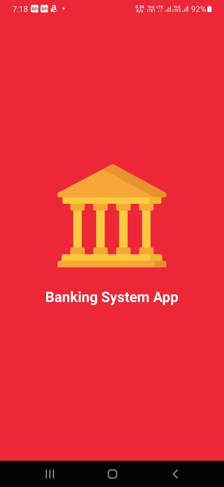
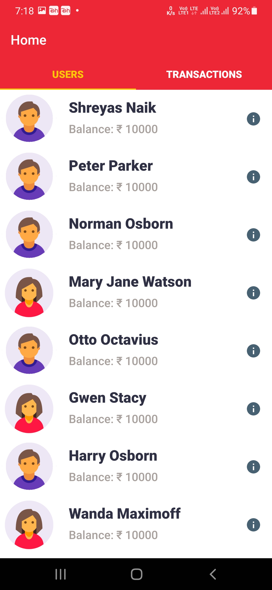
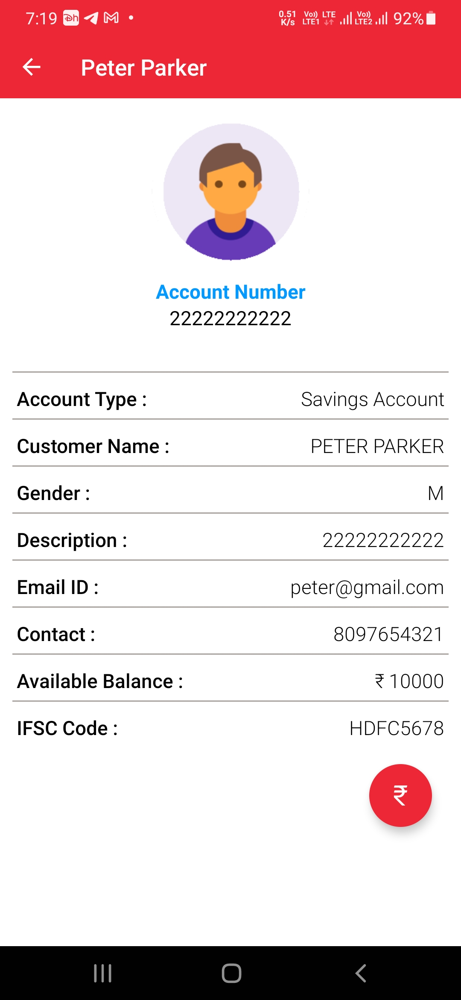
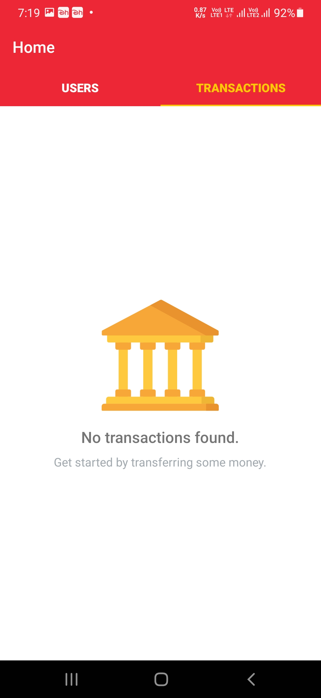
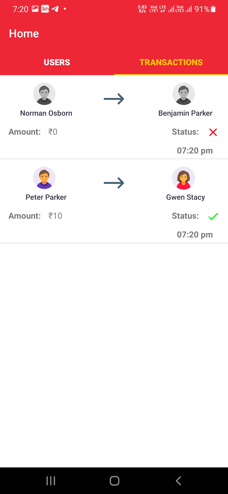
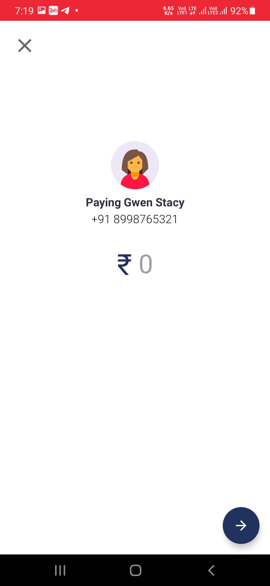

# BankingSystemApp
👇
 
<a href="https://youtu.be/JeUVc6xqoeg">Click here for video demonstration</a>
<table style="border-colapse: colapse;">
  <tr>
    <th>Splash Screen</th>
    <th>Home Screen</th>
  </tr>
  <tr>
    <td></td>
    <td></td>
  </tr>
  <tr>
    <th>User Info</th>
    <th>Select Recipient</th>
  </tr>
  <tr>
    <td></td>
    <td></td>   
  </tr>
  <tr>
    <th>Empty Transaction List</th>
    <th>Transaction History</th>
  </tr>
  <tr>
    <td></td>
    <td></td>
  </tr>
  <tr>
    <th>Amount Input</th>
    <th></th>
  </tr>
  <tr>
    <td></td>
    <td></td>
  </tr>
</table>
<h2></h2>
  

